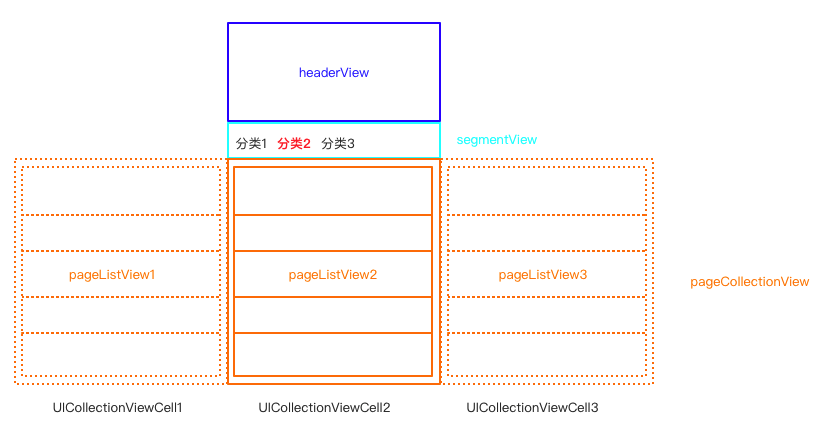
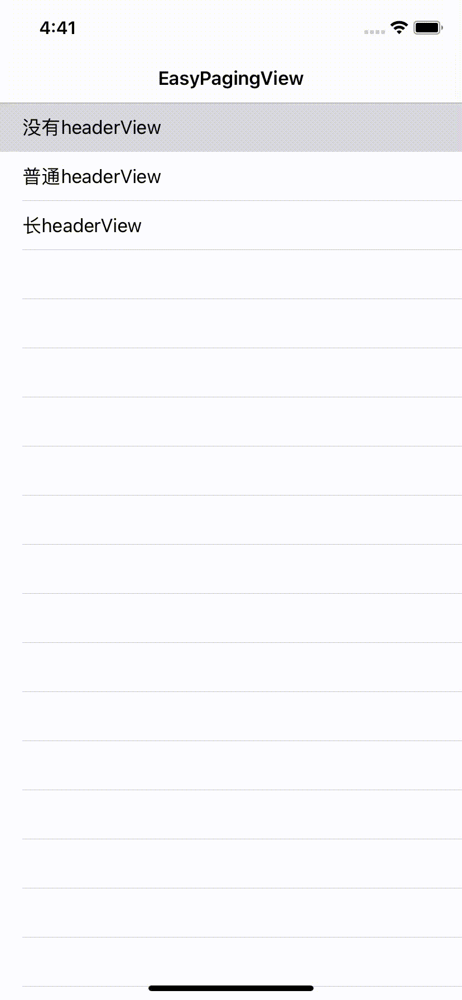
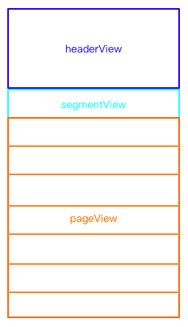
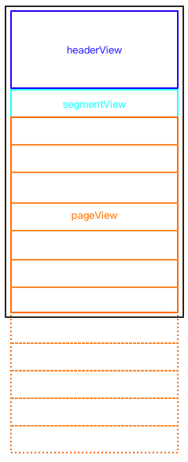
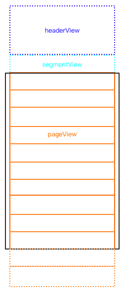
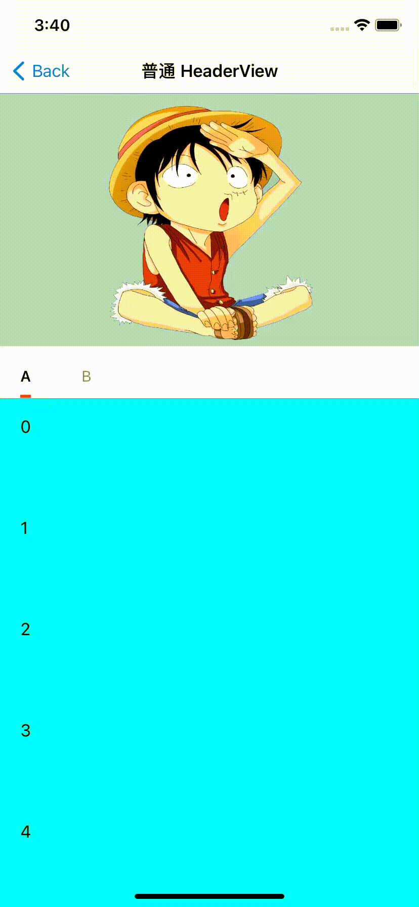
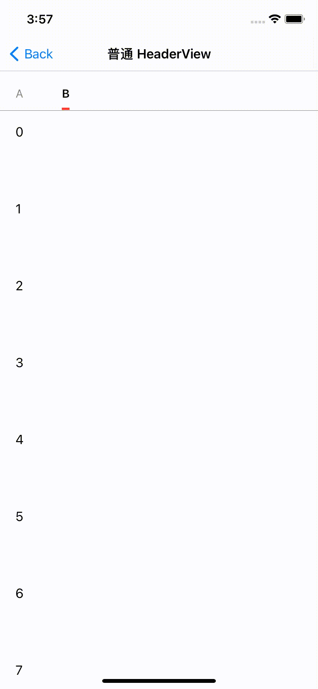
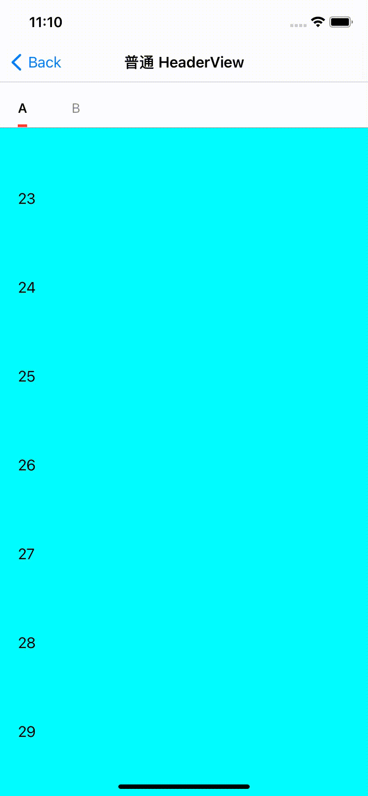
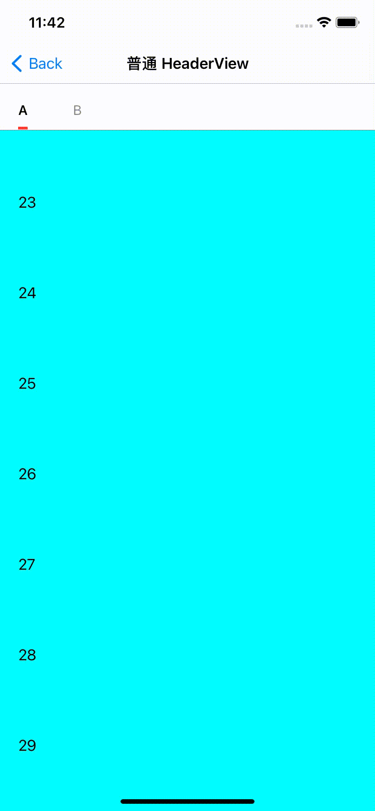

# 简介

`EasyPagingView` 功能上由三部分组成：headerView、segmentView、pageCollectionView。



根据 headerView 的情况，再细分为三种模式：

* 模式一：没有 headerView；
* 模式二：普通 headerView，即 headerView 为简单视图，且高度小于屏幕高度；
* 模式三：长 headerView，即 headerView 为复杂视图，且高度大于屏幕高度。



`EasyPagingView` 是一个分类列表，segmentView 包括若干个分类列表，pageCollectionView 则显示相关分类的列表信息。几乎所有 app 都包含该功能，而该功能的主要有以下关键点：

1. headerView、segmentView、pageCollectionView 上下滑动流畅；
2. pageCollectionView 左右滑动切换不同分类；
3. pageCollectionView 左右切换时，能保持不同页面滚动位置。
4. 向上滑动时，能够加载当前分类下一页数据。
5. 模式三，segmentView 位于底部时，能够拖动 segmentView 向上滑动。

由于系统并没有提供组装 headerView、segmentView、pageCollectionView 的视图控件，要实现上述功能的最直接的方法就是 UIScrollView、UITableView、UICollectionView 之间嵌套，但嵌套也带来滚动手势之间互相冲突，导致滑动不自然等不良的用户体验。

# 尝试方案

以下代码均为核心代码和伪代码，实际可参考源码。

## headerView + segmentView + 单列表

实现上述全部功能是比较困难的，我们先实现一个相对简单的功能：将 pageCollectionView 可以左右滑动多列表，简化为只有一个列表 pageListView。简化后的示意图：



headerView 和 segmentView 为 UIView，pageListView 为 UITableView，现需要将这三个视图组合在一起，滑动屏幕时，三者可以同时滑动。容易想到的方案，就是将三个视图添加到 UIScrollView，依靠 UIScrollView 实现滑动，将 pageListView.isScrollEnabled 设置为 false ，并将 UIScrollView 的 contentSize.height 设置为三个视图高度之和：

```swift
let headerView = UIView()
scrollView.addSubview(headerView)

let segmentView = UIView()
scrollView.addSubview(segmentView)

let pageListView = UITableView()
pageListView.isScrollEnabled = false
// 且使得 pageListView.frame.height 等于 pageListView.contentSize.height
scrollView.addSubview(pageListView)

scrollView.frame.height = headerView.frame.size.height + segmentView.frame.size.height + pagView.contentSize.height
```

这个方案可以实现这个简化的功能，但 pageListView 作为 UITableView 自动的 UITableViewCell 复用机制却不起作用了，从而可能导致占用大量内存，使得在旧设备滑动卡顿。

我们的目的就是要 headerView、segmentView、pageListView 能够同时滑动，并且 pageListView 保留复用机制。UITableView 的复用机制起作用的基础就是 tableView.frame.height 小于 tableView.contentSize.height。理解了这点，我们就使 pageListView 的高度小于屏幕高度，这样就可以保留复用机制。另外要使 pageListView 位于正确的位置，在滑动过程中，要实时调整 pageListView 的 frame.origin.y 的位置和 pageListView.contentOffset.y 的大小。pagView 调整位置也要根据当前位置采取不同的调整策略：

* pageListView 未滑动 UIScrollView 顶部时，pageListView 根据 UIScrollView 一起滑动，此时 pageListView.contentOffset.y 保持为 0；
* pageListView 超过 UIScrollView 顶部后，pageListView 固定在 UIScrollView 显示区域，并不断调整 pageListView.contentOffset.y。



```swift
class EasyPagingView: UIScrollView {
    var pageListView: UITableView!
    var headerView: UIView!
    var segmentView: UIView!
  
    override func layoutSubviews() {
        super.layoutSubviews()
        
        let headerViewHeight = headerView.frame.height
        let segmentViewHeight = segmentView.frame.height
        let pageListViewOriginY: CGFloat = headerViewHeight + segmentViewHeight
        
        var pageListViewFrame = pageListView.frame
        var pageListViewContentOffsetY: CGFloat = 0
        if self.contentOffset.y < pageListViewOriginY {
          	// pageListView 未滑动到顶部
            pageListViewContentOffsetY = 0
            pageListViewFrame.origin.y = pageListViewOriginY
        } else {
            // pageListView 已滑动到顶部
            pageListViewContentOffsetY = self.contentOffset.y - pageListViewOriginY
            pageListViewFrame.origin.y = self.contentOffset.y
        }
        
        pageListView.contentOffset.y = pageListViewContentOffsetY
        pageListView.frame = pageListViewFrame
      
      	// 计算 UIScrollView 的 contentSize
        let pageListViewHeight = pageListView.contentInset.top + pageListView.contentSize.height + pageListView.contentInset.bottom
        let contentHeight = headerView.frame.height + segmentView.frame.height + pageListViewHeight
        self.contentSize = CGSize(width: bounds.width, height: contentHeight)
    }
}
```

新建 EasyPagingView 并继承 UIScrollView，在 layoutSubviews 方法内调整 pageListView 的位置，同时计算 UIScrollView 的 contentSize 的大小。

# headerView + segmentView + 多分类列表

经过上面的尝试，我们已经实现了 headerView + segmentView + 单列表 功能，能够使三个视图滑动流程，同时保留了单列表（UITableView）的复用机制。实现多分类列表，我们将 pageListView(UITableView) 换为 pageCollectionView(UICollectionView)。


将 pageListView 添加到 UICollectionViewCell，从而实现左右滑动切换 pageListView 分类列表。

```swift
// 以下为 pageListView 添加到 UICollectionViewCell 的核心代码
public func collectionView(_ collectionView: UICollectionView, cellForItemAt indexPath: IndexPath) -> UICollectionViewCell {
        let cell = collectionView.dequeueReusableCell(withReuseIdentifier: "PageListViewCell", for: indexPath)
        var pageListView = pageListViews[indexPath.item] // pageListViews: [UITableView]
        if pageListView == nil {
            let pageListView = UITableView()
            pageListViews[indexPath.item] = pageListView
        }

        if pageListView.superview != cell.contentView {
            cell.contentView.subviews.forEach { $0.removeFromSuperview() }
            pageListView.frame = cell.contentView.bounds
            cell.contentView.addSubview(pageListView)
        }
        return cell
    }
```

当 pageCollectionView 左右滑动切换列表时，需要获取当前的显示的 pageListView：`pageListView = pageListViews[currentIndex]`，重新布局 UIScrollView 的 `contentSize`：

```swift
override func layoutSubviews() {
    super.layoutSubviews()    
		let headerViewHeight = headerView.frame.height
    let segmentViewHeight = segmentView.frame.height
    let pageCollectionViewOriginY: CGFloat = headerViewHeight + segmentViewHeight
    
		let pageListView = pageListViews[currentIndex]
    var pageCollectionViewFrame = pageCollectionView.frame
    var pageListViewContentOffsetY: CGFloat = 0
    if self.contentOffset.y < pageCollectionViewOriginY {
      	// pageListView 未滑动到顶部
        pageListViewContentOffsetY = 0
        pageCollectionViewFrame.origin.y = pageCollectionViewOriginY
    } else {
        // pageListView 已滑动到顶部
        pageListViewContentOffsetY = self.contentOffset.y - pageCollectionViewOriginY
        pageCollectionViewFrame.origin.y = self.contentOffset.y
    }
    
    pageListView.contentOffset.y = pageListViewContentOffsetY
    pageCollectionView.frame = pageListViewFrame
  
  	// 计算 UIScrollView 的 contentSize
    let pageListViewHeight = pageListView.contentInset.top + pageListView.contentSize.height + pageListView.contentInset.bottom
    let contentHeight = headerView.frame.height + segmentView.frame.height + pageListViewHeight
    self.contentSize = CGSize(width: bounds.width, height: contentHeight)
}
```

# 多列表左右切换时，保留各个列表滑动的位置

UIScrollView 通过 contentOffset.y 来设置当前显示的竖直方向的位置。由于 pageCollectionView 包括多个列表，所以有可能在同一时刻，不同的 pageListView 的 contentOffset.y 不相同，以及不同 pageListView 显示时 EasyPagingView 的contentOffset.y 也不同。因此需要记录各个 contentOffset.y 的值。在切换时 pageListView 时，同时切换 contentOffset。

```swift
var currentIndex: Int = 0  // 当前显示第几页
var pageListViewOffsetDict = [Int: CGFloat]()       // 各个列表的 contentOffset.y
var easyPagingViewOffsetDict = [Int: CGFloat]() // 各个列表对应 easyPagingView 的 contentOffset.y
```

其中以后 pageListView 切换时有四种状态：

* 初始向上

在初始向上滑动过程中切换页面，如动图：



此时切换页面，每个 pageListView 的 contentOffset.y 都等于 0，每个 pageListView 对应 easyPagingView 的 contentOffset.y 都相等。

* segmentView 到达顶部

segmentView 到达顶部后切换页面，如动图：


每个 pageListView 对应 easyPagingView 的 contentOffset.y 可能不相同，而每个 pageListView 的 contentOffset.y 可以由 esayPagingView 的 contentOffset.y 减去 pageCollectionViewOriginY 得到。

```swift
// segmentView 未滑动到顶部
var isSegmentViewOnTop: Bool {
    return self.contentOffset.y > self.pageCollectionViewOriginY
}

func horizontalScrollDidEnd(at index: Int) {
    let currentContentOffsetY = easyPagingViewOffsetDict[index] ?? 0
    if isSegmentViewOnTop {
        // segmentView 已经达到顶部，直接切换 contentOffsetY
        self.contentOffset.y = max(self.pageCollectionViewOriginY, currentContentOffsetY)
    }
  
  	self.setNeedLayout()
  	self.layoutIfNeed() // 调用 layoutSubvies()
}
        
```

```swift
override func layoutSubviews() {
    super.layoutSubviews()    
		...
    pageListView.contentOffset.y = pageListViewContentOffsetY
    pageCollectionView.frame = pageListViewFrame
  
    // 记录此时 contentOffset.y
  	pageListViewOffsetDict[currentIndex] = currentPageListViewOffsetY
 	  easyPagingViewOffsetDict[currentIndex] = self.contentOffset.y
  	...
}
```
* 将 B 列表向下滑动过程中，再切换回 A 列表，此后 A 向上 滑动

在这过程中，只滑动 easyPagingView ，固定 A 列表。等 segmentView 滑动到顶部后才开始滑动 easyPagingView。如动图：



```swift
class EasyPagingView: UIScrollView {
		...
  	/// 当 segmentView 未到达最高点时切换列表
    var isSwitchToNewPageWhenSegmentViewNotOnTop: Bool = false
  	...
  
  override func layoutSubviews() {
    	super.layoutSubviews()  
    
    	...
    
			let pageListView = pageListViews[currentIndex]
    	var pageCollectionViewFrame = pageCollectionView.frame	
      let currentPageListViewOffsetY: CGFloat = 0
    
    	if isSwitchToNewPageWhenSegmentViewNotOnTop {
            if !isSegmentViewOnTop {
                currentPageListViewOffsetY = pageListViewOffsetDict[currentIndex] ?? 0
            } else {
                isSwitchToNewPageWhenSegmentViewNotOnTop = false
                self.contentOffset.y += (pageListViewOffsetDict[currentIndex] ?? 0)
            }
            switchToNewPageWhenSegmentViewNotInTopContentOffset = self.contentOffset.y
        }
    
        // segmentView 已滑动到顶部
    		if isSegmentViewOnTop {
            currentPageListViewOffsetY = self.contentOffset.y - pageCollectionViewOriginY
        }
       	pageListView.contentOffset.y = currentPageListViewOffsetY
        pageListViewOffsetDict[currentIndex] = currentPageListViewOffsetY
        easyPagingViewOffsetDict[currentIndex] = self.contentOffset.y
    
    		...
    
		}
  
    // 切花列表
  	func horizontalScrollDidEnd(at index: Int) {
    		let currentContentOffsetY = easyPagingViewOffsetDict[index] ?? 0
    		if isSegmentViewOnTop {
       			// segmentView 已经达到顶部，直接切换 contentOffsetY
       		  self.contentOffset.y = max(self.pageCollectionViewOriginY, currentContentOffsetY)
   			} else {
          	if currentIndex != index {
                isSwitchToNewPageWhenSegmentViewNotOnTop = true
            }
        }
  
  		self.setNeedLayout()
  		self.layoutIfNeed() // 调用 layoutSubvies()
		}
}  
```

* 将 B 列表向下滑动过程中，再切换回 A 列表，此后 A 向下滑动

在这过程中，固定 easyPagingView ，只滑动  A 列表。但因为 A 列表 isScrollEnabled = false。需要将  easyPagingView 的滑动的距离转到 A 列表。等到 A 列表的 contentOffset.y = 0 后，再滑动 easyPagingView。如动图：


```swift
class EasyPagingView: UIScrollView {
		...
  	/// 当 segmentView 未到达最高点时切换列表
    var isSwitchToNewPageWhenSegmentViewNotOnTop: Bool = false
  	/// 当 segmentView 未到达最高点切换列表时 easyPagingView 的 contentOffset.y
    /// 用于固定 easyPagingView
  	var switchToNewPageWhenSegmentViewNotInTopEasyPagingViewOffset: CGFloat = 0
  	...
  
  override func layoutSubviews() {
    	super.layoutSubviews()  
    
    	...
    
			let pageListView = pageListViews[currentIndex]
    	var pageCollectionViewFrame = pageCollectionView.frame	
      let currentPageListViewOffsetY: CGFloat = 0
    
      // 记录 easyPagingView 滑动的距离，并将该距离转到 pageListView 上
    	var switchToNewPageAndScrollDownOffsetY: CGFloat = 0
      if isSwitchToNewPageWhenSegmentViewNotOnTop {
            if isScrollingDown {
                // 向下滚动
                switchToNewPageAndScrollDownOffsetY = self.contentOffset.y - switchToNewPageWhenSegmentViewNotInTopEasyPagingViewOffset
                self.contentOffset.y = switchToNewPageWhenSegmentViewNotInTopEasyPagingViewOffset
            }

            if !isSegmentViewOnTop {
                currentPageListViewOffsetY = pageListViewOffsetDict[currentIndex] ?? 0
                // 将 easyPagingView 滑动的距离转到 pageListView 上
                currentPageListViewOffsetY += switchToNewPageAndScrollDownOffsetY
            }
            switchToNewPageWhenSegmentViewNotInTopEasyPagingViewOffset = self.contentOffset.y
        }
    
        // segmentView 已滑动到顶部
    		if isSegmentViewOnTop {
            currentPageListViewOffsetY = self.contentOffset.y - pageCollectionViewOriginY
        }
       	pageListView.contentOffset.y = currentPageListViewOffsetY
        pageListViewOffsetDict[currentIndex] = currentPageListViewOffsetY
        easyPagingViewOffsetDict[currentIndex] = self.contentOffset.y
    
    		...
    
		}
  
    // 切花列表
  	func horizontalScrollDidEnd(at index: Int) {
    		let currentContentOffsetY = easyPagingViewOffsetDict[index] ?? 0
    		if isSegmentViewOnTop {
       			// segmentView 已经达到顶部，直接切换 contentOffsetY
       		  self.contentOffset.y = max(self.pageCollectionViewOriginY, currentContentOffsetY)
   			} else {
          	if currentIndex != index {
                isSwitchToNewPageWhenSegmentViewNotOnTop = true
              	// 记录切换列表时，easyPagingView 的 contentOffset.y
              	switchToNewPageWhenSegmentViewNotInTopEasyPagingViewOffset = contentOffset.y
            }
        }
  
  		self.setNeedLayout()
  		self.layoutIfNeed() // 调用 layoutSubvies()
		}
}
```

# headerView 为 UIScrollView/UITableView /UICollectionView

当 headerView 为 UIScrollView/UITableView /UICollectionView 时，和尝试方案中 pageListView(UITableView) 类似，需要在 EasyPagingView 的 layoutSubviews() 调整 headerView 的 frame 和 contentOffset.y，这样才能保持 UITableView 和 UICollectionView 保持复用机制。不过和 pageListView 有一点不一样的地方，headerView 位于最前面，有可能向上滑动屏幕。所以需要使得 headerView 的高度显示在屏幕中高度一致。


```swift
func layoutSubviews() {
    super.layoutSubview()
  
    if let headerScrollView = headerView as? UIScrollView {
        var frame = headerScrollView.frame
        var headerContentOffset = headerScrollView.contentOffset
      
        if self.contentOffset.y < 0 {
            headerContentOffset.y = 0.0
            frame.origin.y = 0
        } else {
            headerContentOffset.y = self.contentOffset.y - 0
            frame.origin.y = self.contentOffset.y
        }
      
        let remainingBoundsHeight = self.bounds.maxY
        let remainingContentHeight = max(headerScrollView.contentSize.height - contentOffset.y, 0.0)
        frame.size.height = min(remainingBoundsHeight, remainingContentHeight)
      	headerScrollView.frame = frame
    }
}
```

# 上滑加载更多

集成 `MJRefresh` 控件时，向上滑动却不能加载更多：

 

因为 `MJRefresh` 需要使用 pageListView 的 isDragging 属性，但由于 pageListView 为 isScrollEnabled = false，而是通过自行给 pageListView.contentOffset.y 设置值的，所以 pageListView 的 isDragging 一直为 false，导致 pageListView 不能向上加载更多。

```swift
open var isDragging: Bool { get }
```

`isDragging` 属性为只读，我们不能自行将 `pageListView.isDragging`。那我们能不能 KVC 来给 `isDragging 设置值呢？`。答案也是不行的，因为使用 KVO 会编译器会重写属性的 `setter` 方法，但编译器并没有为只读属性生成 `setter` 方法。

`setter` 方法行不通，那只能从 `getter` 方法入手了。当 MJRefresh 访问 `isDragging` 属性时，实际上时调用  `isDragging` 对应的 `getter`，即 `isDragging()`。于是可以 swizzling `isDragging()` 方法，当 MJRefresh 访问 `isDragging` 属性时，实际上是调用我们实现的 `isEasyDragging()`。在 `isEasyDragging()` 我们就可以返回正确的值。同时还需要给 EasyPagingView 增加一个关联属性 `isCurrentDragging`，来记录此时 pageListView 的 `isDraging` 正确的值。

因为所有滑动都是通过 EasyPageListView 来完成，所以也认为 EasyPageListView 的滑动状态就是当前 pageListView 的滑动状态，而我们可以通过 UIScrollViewDelegate 来监控 EasyPagingView 的滑动状态。

```swift
class EasyPagingView: UIScrollView {
  
    ....
  	public weak var dataSource: EasyPagingViewDataSource? {
        didSet {
            UIScrollView.swizzleIsDragging
        }
    }
  
    public func scrollViewWillBeginDragging(_ scrollView: UIScrollView) {
        if isSegmentViewOnTop {
            pageListViews[currentIndex].isCurrentDragging = true
        } else {
            pageListViews[currentIndex].isCurrentDragging = nil
        }
    }
  
    public func scrollViewDidEndDragging(_ scrollView: UIScrollView, willDecelerate decelerate: Bool) {
        pageListViews[currentIndex].isCurrentDragging = nil
    }
    ....
  
}

extension UIScrollView {
    
    private struct AssociatedKeys {
        static var isEasyDraggingEnableKey = "isEasyDraggingEnableKey"
        static var isCurrentDraggingEnableKey = "isCurrentDraggingEnableKey"
    }
    
    var isCurrentDragging: Bool? {
        get {
            return objc_getAssociatedObject(self, &AssociatedKeys.isCurrentDraggingEnableKey) as? Bool
        }
        set {
            objc_setAssociatedObject(self, &AssociatedKeys.isCurrentDraggingEnableKey, newValue, objc_AssociationPolicy.OBJC_ASSOCIATION_ASSIGN)
        }
    }
    
    @objc func isEasyDragging() -> Bool {
        if let isCurrentDragging =  isCurrentDragging {
            return isCurrentDragging
        }
        return isEasyDragging()
    }
    
    static let swizzleIsDragging: () = {
        let scrollViewOriginalSelector = #selector(getter: UICollectionView.isDragging)
        let tableViewSwizzledSelector = #selector(UICollectionView.isEasyDragging)
        
        swizzleMethod(scrollViewOriginalSelector, withSelector: tableViewSwizzledSelector)
    }()
    
    static func swizzleMethod(_ selector: Selector, withSelector: Selector) {
        let originalSelector = class_getInstanceMethod(self, selector)
        let swizzledSelector = class_getInstanceMethod(self, withSelector)
        if let originalSelector = originalSelector, let swizzledSelector = swizzledSelector {
            method_exchangeImplementations(originalSelector, swizzledSelector)
        }
    }
}
```

这样 MJRefresh 就可以访问 isDragging 正确的滑动状态：

