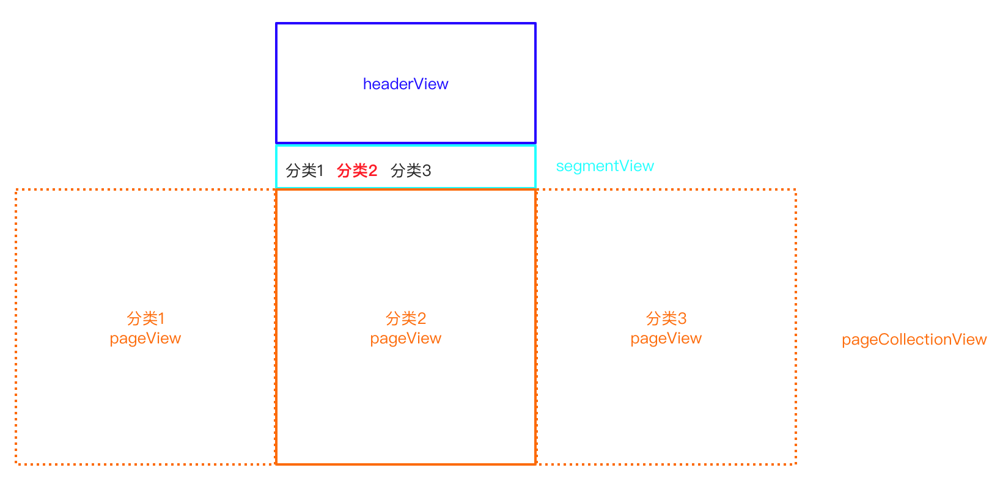
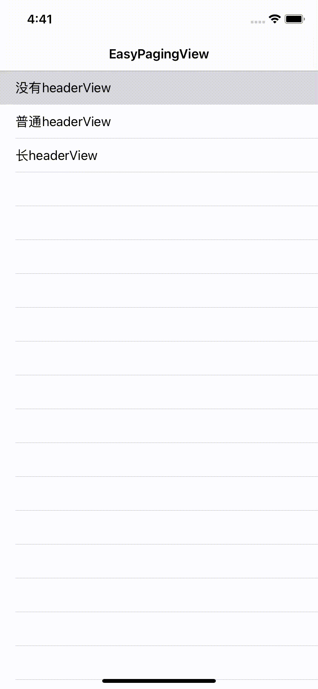
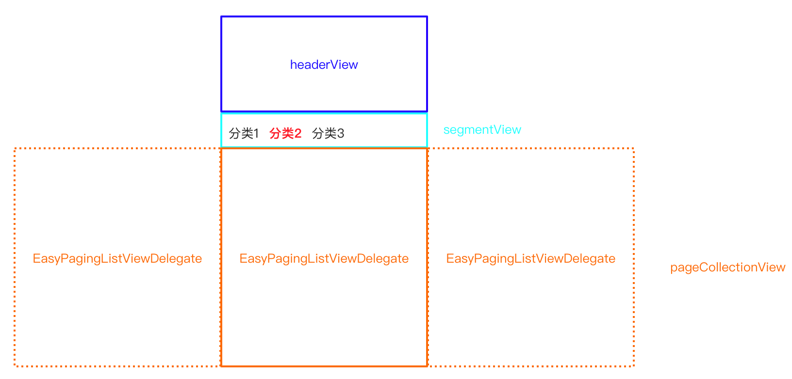
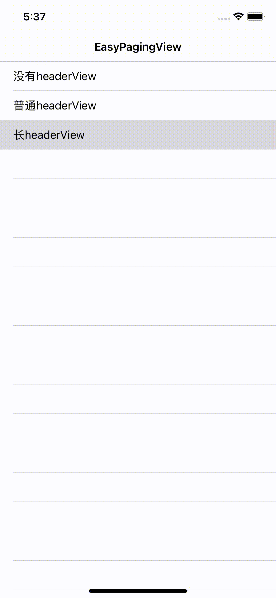

# EasyPagingView

EasyPagingView 是一个分类列表视图，能轻松集成多个不同的分类列表，左右滑动切换分类页面，向上滑动加载当前分类更多的内容。实现原理可以看另一篇[文章](./Document/原理.md)。

# 组成

有三部分组成：headerView、segmentView、pageCollectionView。



# 功能

1. 三种模式



三种模式应用于不同场景，模式一没有 headerView；模式二的 headerView 比较简单且高度小于屏幕高度，通常为 UIImageView；模式三的 headerView 比较复杂且高度大于屏幕高度，通常为 UITableView。

2. 左右滑动切换页面，或点击segmentView切换页面；切换页面时，保留不同页面滚动位置。
3. 懒加载不用页面，当页面出现时，才加载当前页面内容。
4. 模式一，向下滑动刷新列表，向上滑动加载更多。
5. 模式二、三，向上滑动加载更多，不支持刷新。
6. 模式三，可以向上拖动 segmentView。

# 使用

## 基础使用

创建 `EasyPagingView` 并指定 `headerView` 和 `segmentView`。

```swift
// 创建 `EasyPagingView`
let containerView = EasyPagingView(frame: frame)
containerView.dataSource = self
containerView.contentInsetAdjustmentBehavior = .never
self.view.addSubview(containerView)

// 创建 headerView
let headerView = UIImageView(frame: CGRect(origin: .zero, size: CGSize(width: view.bounds.width, height: 250)))
headerView.image = UIImage(named: "header")
containerView.headerView = headerView

// 创建 `segmentView`
let segmentView = SegmentView(frame: CGRect(origin: .zero, size: CGSize(width: UIScreen.main.bounds.width, height: 52)))
segmentView.backgroundColor = .white
egmentView.titleList = ["分类1", "分类2", "分类3"]
segmentView.pageCollectionView = containerView.pageCollectionView
containerView.segmentView = segmentView
segmentView.reloadData()
containerView.reloadData()
```

## 实现 `EasyPagingViewDataSource`

实现 `EasyPagingViewDataSource` 数据源的方法为`pageCollectionView` 提供具体的列表内容。

```swift
protocol EasyPagingViewDataSource: NSObjectProtocol {

  	// 列表数量
    func numberOfLists(in easyPagingView: EasyPagingView) -> Int
  	// 返回实际的列表，且该列表需遵循 `EasyPagingListViewDelegate` 协议
    func easyPagingView(_ easyPagingView: EasyPagingView, pageForItemAt index: Int) -> EasyPagingListViewDelegate
}
```

## 实现 `EasyPagingListViewDelegate`

```swift
protocol EasyPagingListViewDelegate: NSObjectProtocol {
    var pageView: UIView { get } // pageListView 的父类
    var pageListView: UICollectionView { get } // 实际的列表视图
    func pageListViewWillAppear()              // 列表即将显示
    func pageListViewDidAppear()               // 列表已显示
    func pageListViewDidDisappear()            // 列表已消失
}
```



每个列表视图都要遵循 `EasyPagingListViewDelegate` 协议，由该协议提供实际的列表。同时该协议也提供了列表的生命周期方法。

## 实现 `EasyPagingViewDelegate`

该代理仅适用于模式三，在模式三下，`segmentView` 可以手动向上或向下拖动。以下方法可以追踪 `segmentView` 的状态。

```swift
protocol EasyPagingViewDelegate: NSObjectProtocol {
    func segmentViewWillBeginPaningToTop() // segmentView 即将往上拖动
    func segmentViewDidPaningToTop()       // segmentView 已被拖动到顶部
    func segmentViewWillBeginPaningToBottom() // segmentView 即将往下拖动
    func segmentViewDidPaningToBottom() // segmentView 已被拖动到底部
}
```


