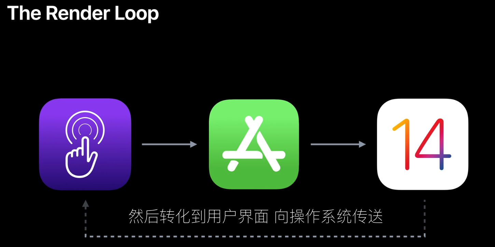
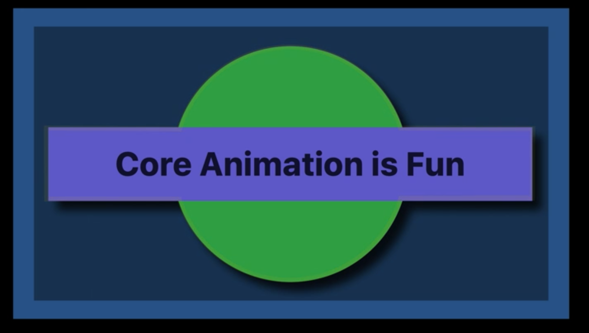
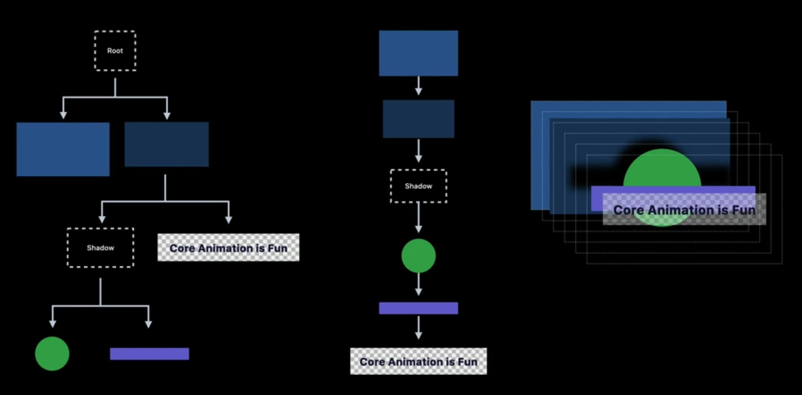
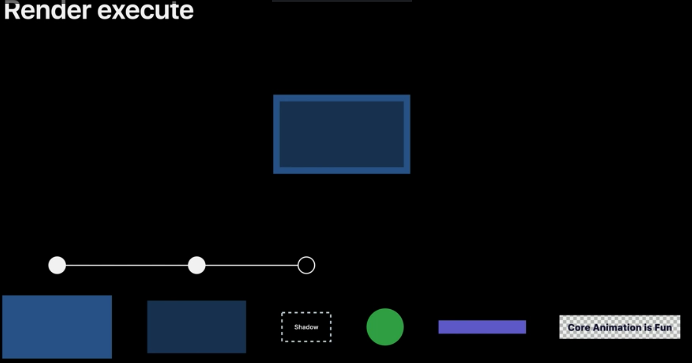
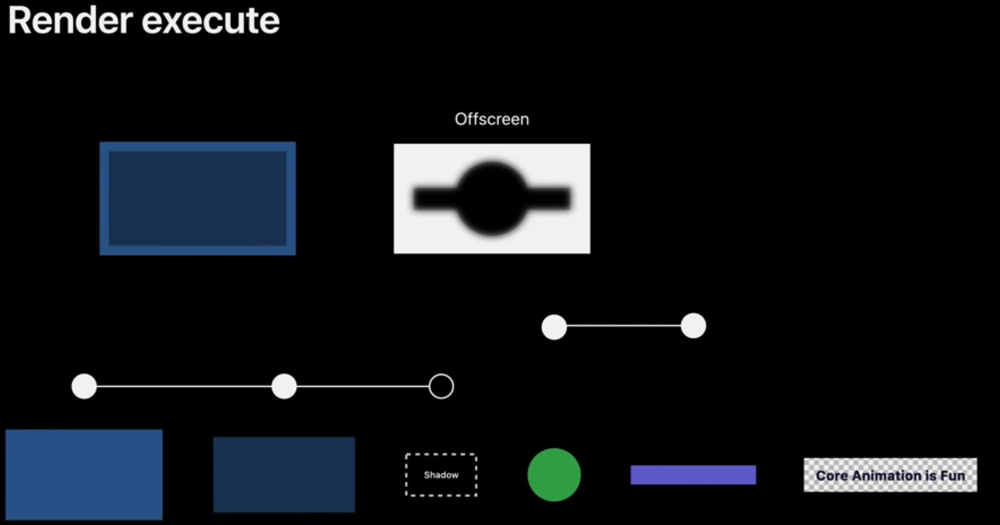
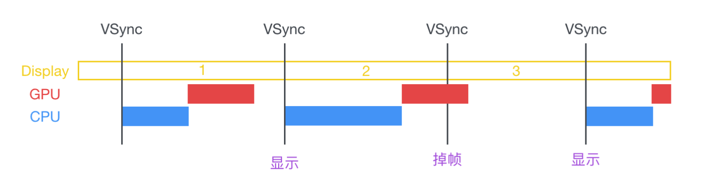
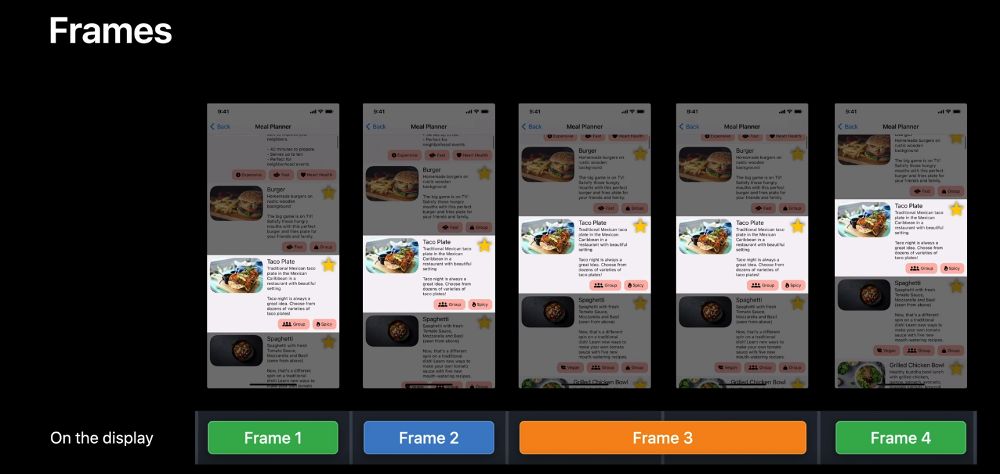
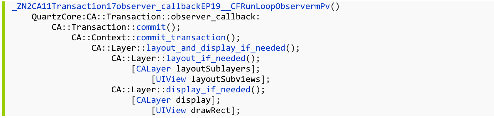

# 渲染循环

当一个事件(触摸/网络回调/Timers/摇晃等)发生后，系统将事件发送给需要的 app 进程，app 对需要改动的视图进行重新布局或绘制并渲染出来，向用户展示。

渲染渲染分为 5 个阶段：事件阶段-> 提交阶段 -> 渲染准备阶段 -> 渲染执行阶段 -> 显示。

## 事件阶段（Event phase）

app 接收到事件，需要更新的视图会被标记为 "Layout needed"或"Display needed"，UIKit 会合并“需要布局”的请求，并在下一阶段（提交阶段）计算新的布局或绘制，以减少重复工作。

### 被标记重新布局的操作

* 改变视图位置（frame，bounds，transform）
* 增加或删除视图
* 调用 setNeedsLayout()

### 被标记需要重新绘制的操作

* 所有重写了 draw(rect:) 的视图
* 调用 setNeedsDisplay()

## 提交阶段（Commit phase）

UIKit 将在事件阶段将被标记重新布局的视图，从父视图到子视图依次布局，并调用 layoutSubviews()方法。而被标记为重新绘制的视图，从父视图到子视图依次绘制，并调用 draw(rect:)。提交阶段是常见的性能瓶颈，因为只有几毫秒去完成布局和绘制。

当所有视图已经布局并绘制好了，会组成一个图层树，并发送到渲染服务器进行渲染。

## 渲染准备阶段（Render prepare phase）

在渲染准备阶段，提交阶段生成的图层树，被编译成一系列简单的操作，供图形处理器执行。

以下面这张图（长条和圆形周围都有阴影）举例，了解一帧的渲染过程：

下图左侧部分为 app 提交到渲染服务器的图层树，渲染服务器从根视图逐层编译成一系列的绘图命令，使图形图形处理器从根节点开始，同级到同级，父级到子级，直到涵盖所有图层。

最终产生下图中绘制顺序的命令:

## 渲染执行阶段（Render execte phase)

在渲染执行阶段，图形处理器利用上一阶段产生的命令，将每一步都绘制成中间的最终纹理。

### 离屏渲染

离屏渲染是图形处理器，必须先在其它地方渲染一个图层，然后再将其复制过来。 就阴影而言，它必须绘制阴影所属图层以确定最终形状。

继续以上面的示例，绘制长条和圆形的阴影。

当绘制完两个蓝色的长条后，开始绘制阴影。由于阴影的形状由上面的长条和圆形定义，并且长条和圆形还没绘制，所以此时图形处理器不知道怎么绘制阴影。 但如果我们先绘制圆形和长条再绘制阴影，那么阴影会用黑色遮挡它们。

图形处理器需要在其他地方绘制长条和圆形，然后将图层变成黑色，并将其模糊。

然后阴影图层复制回之前的图层上。

离屏渲染可能会积少成多，导致渲染出现卡顿。有四种主要类型的离屏通道可以优化： 阴影、蒙版、圆角矩形和视觉效果。

## 显示阶段

显示器显示图像。

# 图像显示过程

图片来源：iOS 保持界面流畅的技巧

渲染循环的五个阶段，其中事件阶段和提交阶段由 CPU 处理，进行视图布局和绘制，产生图层树。渲染准备阶段和渲染执行阶段由 GPU 处理，GPU对图层树进行解析并渲染，渲染完成后将渲染结果放入帧缓存区(FrameBuffer)，等待显示。

显示器的硬件时钟按照特定频率产生一系列的定时信号 VSync，当 VSync 信号发出后，进行新的一帧渲染和缓冲区更新。其中 iPhone 和 iPad 60Hz，意味着每 16.67 ms 就产生一个信号，iPad Pro 120Hz，意味着每 8.33 ms 就产生一个信号。

# 卡顿

## 卡顿产生的原因

当 VSync 信号发出后，CPU 开始布局并绘制视图，然后提交给GPU进行渲染。如果下一个VSync 信号发出后，该帧还没准备好，显示器就会显示上一帧的内容，这就发生了卡顿。

## 卡顿的类型

卡顿有两种类型：提交卡顿和渲染卡顿，分别对应渲染循环中的提交阶段和渲染阶段（渲染准备和渲染执行）。提交阶段由 CPU 处理，发生卡顿，是因为 CPU 处理布局和绘制时间过长。同理，渲染是因为 GPU 处理时间过程。

### 卡顿的解决方案

卡顿通常出现在 UITableView 和 UICollectionView 的滚动时。这两个列表视图的 Cell 重用机制，会使滚动出屏幕的 Cell.removeFromSuperview()，新出现的 Cell 被 addSubview 到列表中。在滚动中，不断有 Cell 滚动出屏幕，同时又有 Cell 进入屏幕，也就会不断地 removeFromSuperview 和 addSubview，这两个操作是非常耗性能的，会导致 Cell 不断重新布局和绘制。那为什么要有重用机制呢？因为重用可以节省内存。想要即节省内存，也要避免卡顿。

#### 针对提交卡顿（CPU）

##### 保持轻量

* 使用  CALayer
* 尽量不要重写 draw(rect: )
* 使用 hidded

##### 减少重复布局

* 使用 setNeedsLayout()，非必要不使用 layoutIfNeeded()
* 减少视图的约束（自动布局）

##### 异步绘制文本

当 UILabel 需要显示大量文本时，由于 UILabel 在主线程绘制文本，有可能阻塞主线程。可以自定义文本控件，基于 Core Text 并在子线程进行绘制。可以参考我写的 [EasyLabel](https://github.com/quanhuapeng/EasyLabel)

##### 提前计算好布局

在 iOS 12 后，AutoLayout 有了明显提升，对于简单列表 AutoLayout 不会称为性能瓶颈。但列表复杂或对性能有高的要求，最好提前算好布局

针对以下建议，举个两个示例。下图是列表一个 Cell 的内容

由于中间部分的文本和图片的高度都不确定，在获取所有列表时，可以在一个子线程计算好每个 Cell 的高度和相关的布局信息，并存储起来。另外中间部分文本也可以使用异步绘制。下图 Cell 中高度固定，但包含很多内容，并且所有内容都是文本或图片。对于文本内容，如果每个内容都用一个 UILabel 显示，将会创建非常多的子视图。由于这内容都是非交互的。所以我们可以将所有文本内容绘制到一个 UIView 上，从而减少创建视图。

#### 针对渲染卡顿（GPU）

##### 正确设置阴影、圆角、遮罩

* 阴影

  设置 CALayer 的 shadowPath

* 圆角

  单独设置 cornerRadius 和 masksToBounds 都不会产生离屏渲染，因为单独设置只会对本视图起作用，而不会影响子视图。同时设置会离屏渲染，因为会对整个视图圆角都裁剪，如果子视图和被裁剪的圆角重叠，那么在绘制圆角时，由于未绘制子视图，所以图像处理器不知道怎么处理子视图，就得和上述阴影一样，在其他地方确定视图和所有子视图的形状，导致离屏渲染。

  避免圆角产生离屏渲染：

  1. 不要同时设置 cornerRadius 和 masksToBounds；
  2. 本地图片可以让设计师提供有圆角的图片；
  3. 网络图片，在图片服务器处理圆角或者用图片库异步处理圆角。

* 遮罩

  使用 CAGradientLayer 渐变图层来实现简单的图层渐变效果。

# 界面相关

## 界面绘制与 RunLoop（引用[深入理解RunLoop](https://blog.ibireme.com/2015/05/18/runloop/))

当在操作 UI 时，比如改变了 Frame、更新了 UIView/CALayer 的层次时，或者手动调用了 UIView/CALayer 的 setNeedsLayout/setNeedsDisplay方法后，这个 UIView/CALayer 就被标记为待处理，并被提交到一个全局的容器去。

苹果注册了一个 Observer 监听 BeforeWaiting(即将进入休眠) 和 Exit (即将退出Loop) 事件，回调去执行一个很长的函数：
_ZN2CA11Transaction17observer_callbackEP19__CFRunLoopObservermPv()。这个函数里会遍历所有待处理的 UIView/CAlayer 以执行实际的绘制和调整，并更新 UI 界面。

这个函数内部的调用栈大概是这样的：

### 参考

[深入理解RunLoop](https://blog.ibireme.com/2015/05/18/runloop/)

[Explore UI animation hitches and the render loop](https://developer.apple.com/videos/play/tech-talks/10855)